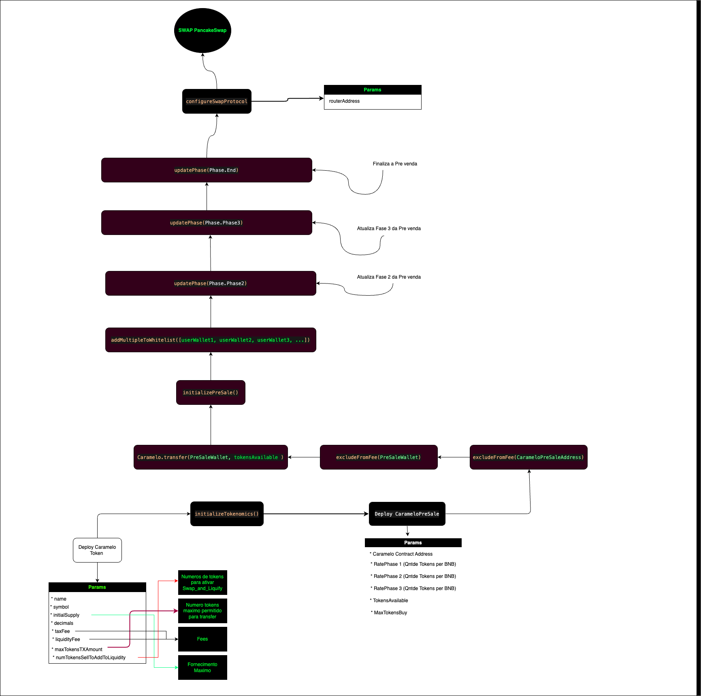
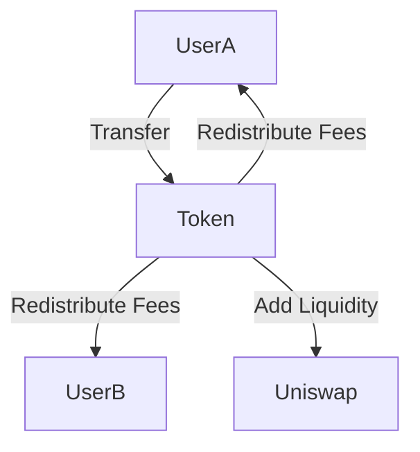
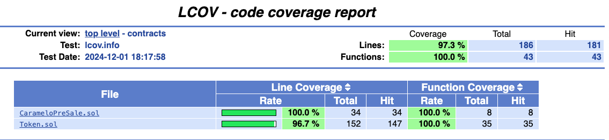
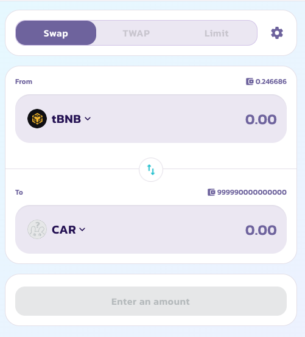

# Caramelo Token Documentation

## Overview

The Caramelo Token is a comprehensive ERC20-compliant token designed for advanced token management. It includes features like tax redistribution, liquidity provision via Uniswap, burning mechanisms, and UUPS upgradeability.

---

### deploy

total suppply: 420000000000000000000000
decimals: 6
taxFee: 5000 //5% 
liquidityFee: 5000 //5% 
maxTokensTxAmount: 126000000000000000 //30% 
numTokensSellToAddToLiquidity: 3780000000000000000000 // 3% de maxTokensTXAmount

PResale

tokenAddress: 0x0000
rate1: 4200000000000
rate2: 2520000000000
rate3: 1680000000000
tokensAvailable: 84000000000000000
maxTokenBuy: 16800000000000000

## Setup Workflow 

  

## Features

- **Tax System**:
  - `taxFee`: Redistribution percentage.
  - `liquidityFee`: Liquidity provision percentage.
  - `burnFee`: Burn percentage for deflationary mechanism.

- **Liquidity Management**:
  - Integrated with Uniswap for automatic liquidity provisioning.

- **Upgradeability**:
  - Supports UUPS upgrade pattern with upgrade freezing.

- **Reflection Mechanism**:
  - Redistribution of fees to holders based on balances.

---

## Contract Details

### State Variables

| Variable                     | Type         | Description                                                      |
|------------------------------|--------------|------------------------------------------------------------------|
| `_tTotal`                    | `uint256`    | Total token supply.                                             |
| `_rTotal`                    | `uint256`    | Total reflected supply.                                         |
| `_allowances`                | `mapping`    | Mapping of approved allowances for token transfers.             |
| `_isExcludedFromFee`         | `mapping`    | Mapping of accounts excluded from fees.                         |
| `taxFee`                     | `uint256`    | Percentage of transactions redistributed to holders.            |
| `liquidityFee`               | `uint256`    | Percentage of transactions added to liquidity.                  |
| `burnFee`                    | `uint256`    | Percentage of transactions burned.                              |
| `maxTxAmount`                | `uint256`    | Maximum allowed transaction amount.                             |
| `numTokensSellToAddToLiquidity` | `uint256` | Tokens required to trigger liquidity provisioning.              |
| `swapAndLiquifyEnabled`      | `bool`       | Indicates if swap and liquify functionality is enabled.          |

---

## Functions

### Public Functions

| Function Name               | Parameters                              | Returns      | Description                          |
|-----------------------------|-----------------------------------------|--------------|--------------------------------------|
| `transfer`                  | `address recipient, uint256 amount`     | `bool`       | Transfers tokens to a specified address. |
| `approve`                   | `address spender, uint256 amount`       | `bool`       | Approves an address to spend tokens. |
| `transferFrom`              | `address sender, address recipient, uint256 amount` | `bool` | Transfers tokens on behalf of the owner. |
| `excludeFromFee`            | `address account`                       | `void`       | Excludes an account from fees.       |
| `includeInFee`              | `address account`                       | `void`       | Includes an account in fees.         |

---

## Events

| Event Name   | Parameters                                      | Description                             |
|--------------|------------------------------------------------|-----------------------------------------|
| `Transfer`   | `address indexed from, address indexed to, uint256 value` | Emitted when tokens are transferred.   |
| `Approval`   | `address indexed owner, address indexed spender, uint256 value` | Emitted when tokens are approved. |

---

## Test Cases

### Setup

#### Initialization
- The `setUp` function initializes the contract, creating owner and user accounts, and setting initial balances.

| Test Case                      | Expected Outcome                                     |
|--------------------------------|-----------------------------------------------------|
| **Initialize contract**         | Owner is excluded from fees and contract is configured correctly. |

#### Errors
| Error Name                     | Description                                       |
|--------------------------------|---------------------------------------------------|
| `OwnerNotExcludedFromFee`      | Thrown when the owner is not excluded from fees.  |
| `TotalSupplyNotMatch`          | Raised if the total supply doesn't match expected value. |

---

### Functional Tests

#### Transfer Without Fees
- Test transfer functionality for excluded accounts.

| Parameter           | Value       |
|---------------------|-------------|
| `excludedUser`      | Any address |
| `transferAmount`    | 1000 tokens |

#### Transfer With Fees
- Tests fee deduction during transfers.

| Parameter           | Value       |
|---------------------|-------------|
| `normalUser`        | Any address |
| `transferAmount`    | 1000 tokens |

---

### Advanced Scenarios

#### Swap and Liquify
- Tests swapping tokens for liquidity provision.

| Scenario                           | Expected Outcome                                    |
|------------------------------------|----------------------------------------------------|
| **Swap tokens for ETH**            | ETH received matches expected value post swap.     |
| **Add liquidity**                  | Liquidity added successfully to Uniswap.           |

#### Reflection Mechanism
- Tests fee redistribution among holders.

| Parameter           | Value       |
|---------------------|-------------|
| `transferAmount`    | 100 tokens  |

---

### Edge Cases

#### Zero Address
- Functions that involve zero address input should revert.

| Function           | Expected Behavior                              |
|--------------------|------------------------------------------------|
| `transfer`         | Reverts when recipient is zero address.        |
| `approve`          | Reverts when spender is zero address.          |

---

## Diagrams

### Token Workflow

---

## Licensing

Licensed under MIT.

---

## Custom Errors

| Error Name                         | Parameters                                  | Description                                                          |
|------------------------------------|--------------------------------------------|----------------------------------------------------------------------|
| `OwnerNotExcludedFromFee`          | -                                          | Thrown if the owner is not excluded from fees after initialization.  |
| `TotalSupplyNotMatch`              | `uint256 actualSupply, uint256 expectedSupply` | Raised if total supply does not match the expected value.           |
| `MaxTransactionExceeded`           | `uint256 maxTxAmount, uint256 attemptedAmount` | Raised if a transaction exceeds the maximum allowed amount.         |
| `NumTokensSellToAddToLiquidityFailed` | `uint256 currentAmount, uint256 newAmount` | Thrown if liquidity addition threshold fails to update.             |
| `ZeroAddress`                      | -                                          | Thrown when attempting to use the zero address in a critical operation. |
| `AlreadyExcluded`                  | -                                          | Raised if an account already excluded from fees is excluded again.  |
| `NotExcluded`                      | -                                          | Raised if an account not excluded from fees is included again.      |
| `FeesExceeded`                     | `uint256 totalFees`                        | Raised if the total of all fees exceeds 100%.                       |
| `InsufficientBalance`              | `uint256 available, uint256 required`      | Raised if an account lacks sufficient balance for a transfer.       |
| `TokenBalanceZero`                 | -                                          | Thrown if an operation is attempted with a zero token balance.      |
| `TransferAmountExceedsMax`         | -                                          | Raised when a transfer exceeds the maximum transaction amount.      |
| `TransferAmountZero`               | -                                          | Raised if the transfer amount is zero.                              |

---

## Events

| Event Name                   | Parameters                                      | Description                                                          |
|------------------------------|------------------------------------------------|----------------------------------------------------------------------|
| `Transfer`                   | `address indexed from, address indexed to, uint256 value` | Emitted when tokens are transferred.                                |
| `Approval`                   | `address indexed owner, address indexed spender, uint256 value` | Emitted when an approval is made for a spender.                    |
| `OwnershipTransferred`       | `address indexed previousOwner, address indexed newOwner` | Emitted when contract ownership is transferred.                     |
| `SwapAndLiquify`             | `uint256 tokensSwapped, uint256 ethReceived, uint256 tokensIntoLiquidity` | Emitted when swap and liquify is triggered.                        |
| `ExclusionFromFee`           | `address indexed account`                      | Emitted when an account is excluded from fees.                      |
| `InclusionInFee`             | `address indexed account`                      | Emitted when an account is included back in fees.                   |
| `UniswapV2RouterUpdated`     | `address indexed previousRouter, address indexed newRouter` | Emitted when the Uniswap V2 router address is updated.             |
| `LiquidityAdded`             | `uint256 tokenAmount, uint256 ethAmount`       | Emitted when liquidity is added to Uniswap.                         |

contract:  https://testnet.bscscan.com/token/0x367e257b64457b0c558735766f42f17b110d7709#readContract
par: https://testnet.bscscan.com/address/0x05b0cf5efa12dc9bd83558b4787120a9297d9246

## Coverage

## Test Coverage

The Caramelo Token smart contract has been thoroughly tested to ensure its functionality, security, and reliability. The following aspects have been covered in our test suite:

- **Token Transfers**:
  - Validating successful token transfers between accounts.
  - Ensuring transfers respect the maximum transaction amount.
  - Verifying that transfers to and from zero addresses are handled correctly.

- **Fee Mechanisms**:
  - Testing the application of tax, liquidity, and burn fees on transactions.
  - Ensuring accounts excluded from fees are correctly handled.
  - Verifying that the total fees do not exceed 100%.

- **Liquidity Management**:
  - Testing the automatic liquidity provisioning via Uniswap.
  - Ensuring the correct amount of tokens are swapped and added to liquidity.
  - Verifying the `swapAndLiquify` functionality is enabled and works as expected.

- **Upgradeability**:
  - Testing the UUPS upgrade pattern to ensure the contract can be upgraded securely.
  - Verifying that upgrade freezing works as intended.

- **Reflection Mechanism**:
  - Ensuring the redistribution of fees to holders based on their balances.
  - Verifying that the reflection mechanism correctly updates holder balances.

- **Custom Errors**:
  - Testing scenarios that trigger custom errors to ensure they are raised appropriately.
  - Verifying that error messages provide accurate and helpful information.

- **Events**:
  - Ensuring all relevant events are emitted during contract operations.
  - Verifying the correctness of event parameters.

Our comprehensive test suite ensures that the Caramelo Token contract operates as intended and provides a secure and reliable token management system for users.

Test results and coverage reports can be found in the `docs/coverage` directory.

  

# Pancake Swap Tests 

  

## Author

For more information, you can visit the author's GitHub profile: [Renan Correa](https://github.com/renancorreadev)
